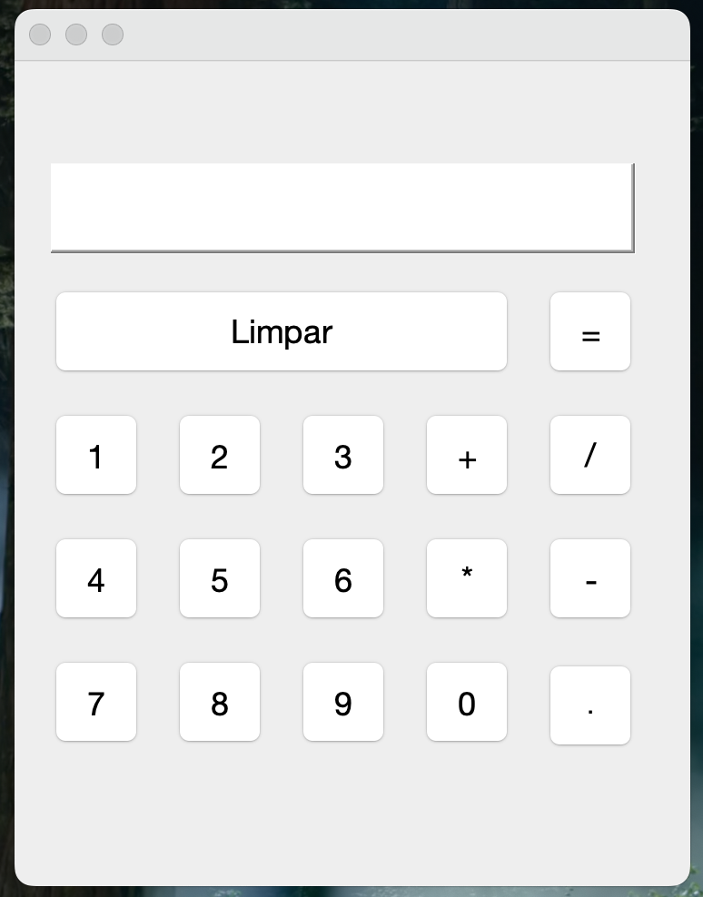

# Calculadora Básica em Java com Interface Gráfica

Este é um projeto de uma **Calculadora Básica** desenvolvida em **Java** utilizando a biblioteca **Swing** para a interface gráfica. A calculadora suporta operações matemáticas simples, como soma, subtração, multiplicação e divisão.

## Funcionalidades

- Soma de dois números.
- Subtração de dois números.
- Multiplicação de dois números.
- Divisão de dois números (com verificação de divisão por zero).
- Interface gráfica desenvolvida com **Swing** no **NetBeans**.

## Tecnologias

- **Java 11+**
- **Swing** (para a interface gráfica)
- **NetBeans IDE** (para desenvolvimento da interface gráfica)

## Como Rodar o Projeto

### Pré-requisitos

- **Java 11 ou superior** instalado.
- **NetBeans IDE** ou qualquer outro editor de sua preferência para rodar projetos Java com GUI.
- Para verificar se o Java está instalado, execute o seguinte comando no terminal:
    ```bash
    java -version
## Instruções

### Clone o repositório para o seu ambiente local:

    git clone https://github.com/seu-usuario/calculadora-java.git

### Abra o projeto no NetBeans:
- Abra o NetBeans.
- Vá até **File > Open Project** e selecione o diretório do projeto clonado.

### Compile e execute o projeto:
- No NetBeans, basta clicar com o botão direito sobre o projeto no painel de **Projects** e selecionar **Run** ou **Executar**.

### Se preferir rodar pelo terminal:
1. Compile o código (caso não esteja no NetBeans):
    ```bash
    javac Calculadora.java
2. Execute o programa:
    ```bash
    java Calculadora
### Exemplo de Uso
Ao rodar o programa, a interface gráfica será aberta. O usuário poderá selecionar a operação desejada, inserir os números e clicar no botão para ver o resultado.

- **Exemplo de interface gráfica:**
  - Você verá botões para cada operação (soma, subtração, etc.), caixas de texto para digitar os números e uma área para mostrar o resultado.

## Screenshots
Aqui está uma captura de tela da interface gráfica:




